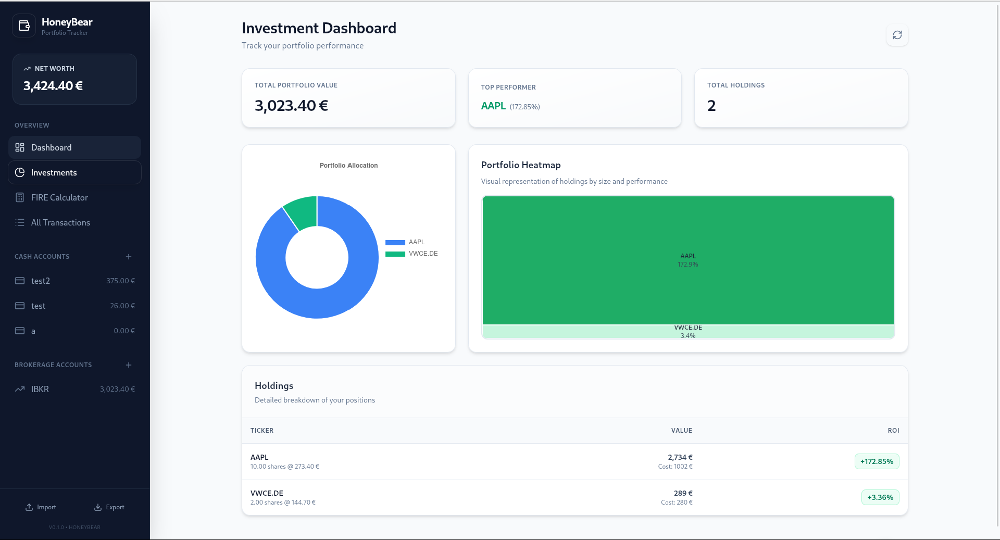

# HoneyBear Folio

<p align="center">
  
</p>

HoneyBear Folio is a cross-platform personal finance desktop application built with Tauri (Rust backend), React (frontend), and SQLite (local database). It focuses on fast local data management (transactions, categories), clear dashboards and charts, secure local storage and privacy mode, portfolio tracking (quotes & historical prices), and robust import/export workflows.



## Features

- Local-first data: all data stored in a local SQLite database (no remote server or required account).
- Transaction management: add, edit, duplicate, and delete transactions (cash and brokerage flows supported including automatic cash leg for trades).
- Import and Export: CSV, JSON and XLSX imports with preview, column mapping, auto-mapping heuristics, per-row progress and reporting, and automatic account creation when needed. Exports (CSV uses dot decimal for numeric fields; XLSX preserves numeric types), plus SQLite database backup via file save dialog.
- Portfolio tracking: holdings calculation (shares, cost basis), real-time quotes and change percent via Yahoo Finance, daily historical price fetch for charts and valuation.
- Dashboards & charts: net worth evolution (custom time ranges + per-account visibility), income vs expenses, expenses by category, and asset allocation breakdown.
- FIRE Calculator: computes a FIRE target and projects years to retirement using historic defaults derived from your accounts and transactions.
- Privacy mode: hide/mask numeric values (keeps currency symbol visible while masking amounts).
- Multicurrency: accounts and transactions can use different currencies; the app fetches and stores exchange rates (current and historical) to compute portfolio valuation and convert amounts for reporting and imports/exports.
- Auto-fill rules: create pattern- or regex-based rules to automatically populate or override transaction fields (category, payee/description, account, notes, tags, etc.). Rules can be prioritized, previewed, and are applied during manual entry and imports to speed data cleanup and categorization.

## Tech Stack

- UI: React 18+, Tailwind CSS, Chart.js (+ `react-chartjs-2`)
- Desktop shell: Tauri
- Backend: Rust
- Database: SQLite (via `rusqlite`)
- Market data: `yahoo_finance_api` (+ `reqwest`)
- File formats:
  - CSV (`csv` crate, plus Papa Parse client-side when needed)
  - JSON (`serde`, `serde_json`)
  - XLSX (`calamine` for reading, `xlsxwriter` for writing; SheetJS optional)

## Project Structure

- `app/`: React + Vite frontend
- `app/src-tauri/`: Tauri + Rust backend
- `img/`: README assets (icon and overview image)

Key paths:

- `app/src/`: React UI
- `app/src/components/`: Main UI components (dashboards, import/export, FIRE)
- `app/src-tauri/src/`: Rust commands, DB access, market-data integration

## Development

Prerequisites:

- Bun v1.3.6+ (JavaScript runtime and package manager)
- Rust toolchain (stable)
- Tauri dependencies for your OS (WebView, build tools)

Linux (Ubuntu/Debian) system deps commonly needed:

```bash
sudo apt-get update
sudo apt-get install -y libwebkit2gtk-4.1-dev libappindicator3-dev librsvg2-dev patchelf
```

Run in development mode:

```bash
cd app
bun install
bun run tauri dev
```

Build a production bundle:

```bash
cd app
bun install
bun run tauri build
```

Useful scripts (from `app/package.json`):

- `bun run dev`: start Vite dev server
- `bun run build`: build frontend (Vite)
- `bun run tauri dev`: run the Tauri desktop app in dev mode
- `bun run tauri build`: create platform bundles/installers
- `bun run version:sync`: sync version into Tauri config and Cargo manifest

## Data Storage

- The SQLite database is stored in the OS-specific “app data” directory as `honeybear.db`.
- This path is derived from Tauri's `app_data_dir()` and created if missing.
- Typical locations (may vary by distro/OS):
  - Linux: `~/.local/share/honeybear-folio/honeybear.db` (or `$XDG_DATA_HOME/...`)
  - macOS: `~/Library/Application Support/honeybear-folio/honeybear.db`
  - Windows: `%APPDATA%\honeybear-folio\honeybear.db`

Tip: if you’re troubleshooting data issues, you can back up this file before testing imports.

## Releases / Versioning

- CI builds releases when you push a tag like `v1.2.3`.
- The release workflow syncs the tag version into:
  - `app/package.json`
  - `app/src-tauri/tauri.conf.json`
  - `app/src-tauri/Cargo.toml`

## Contributing

Contributions are welcome.

- Please read `CONTRIBUTING.md` for setup, coding conventions, and the PR checklist.
- If you’re proposing a larger feature, open an issue first so we can align on scope.

## License

GNU General Public License v3.0. See [LICENSE](LICENSE).

## Distribution

- Package for Windows/macOS/Linux via Tauri bundling
